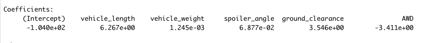
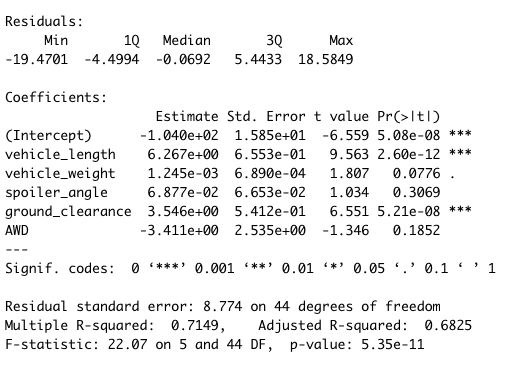
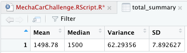
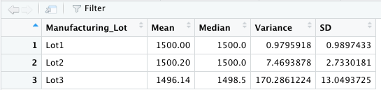
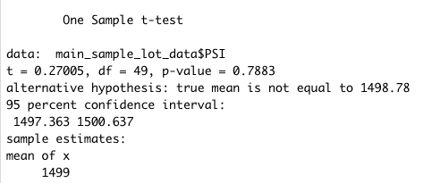

 # MechaCar_Statistical_Analysis

 ## Linear Regression to Predict MPG

With the P Value over 50% this linear regression model can predict the miles per gallon effectively. Vehicle weight has provided us with the non random variance. Slope is not zero  

## Summary Statistics on Suspension

Data shows that all lots are compliant with the design specifitions. Indivdiual data for lot 3 shows a variance of 173 which doesn't the specifications. Please see tables below. 

## T-Test on Suspension Coils

Performed T-Test on four different sample sets from the 3 manufacturing lots (1 combined, 3 indivual lots). The null hyphothesis cannot be rejected based on data. 

## Study Desing: MechaCar vs Competition

Among other things consumers are interested in fuel economy, especially after the recent hike in gas prices. We can design statistical studies that would show MPG data of our protoptypes against competitor vehicles of the same size. Furthemore we can also do a "0 to 60 in x second" comparison between MechaCar and major competitors. I recommend we do the Analysis of Variance (ANOVA). The null and alternative hypotheses would be the statiscal simiarities or differnces between MechCar and competitors' vehicles. We can get our teams to record this data, as far as the competitors data. It should be available publicly and we can access it via APIs. 

